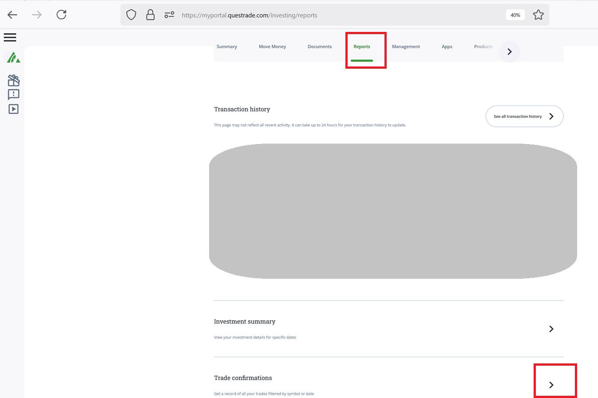
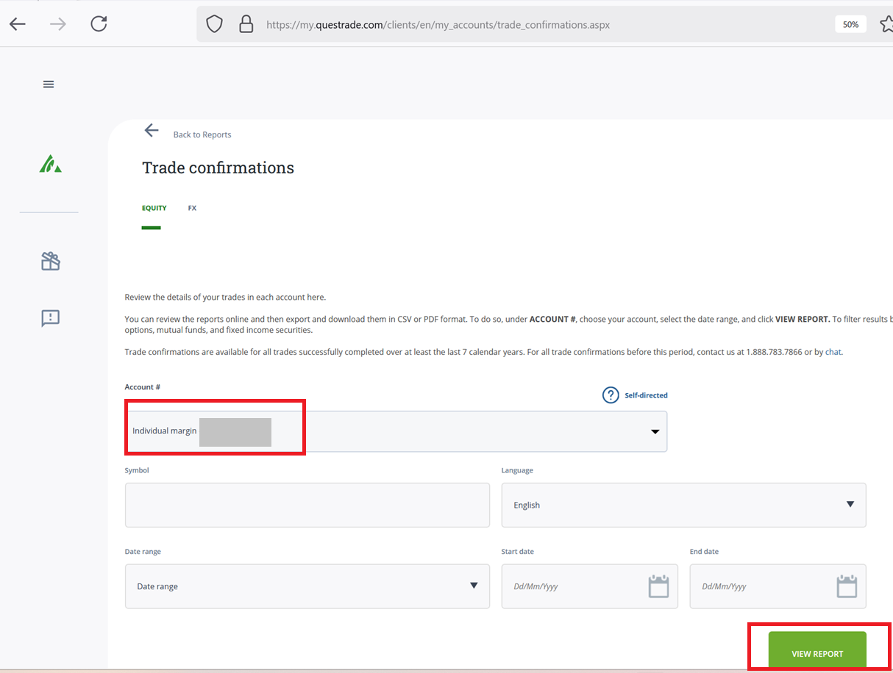
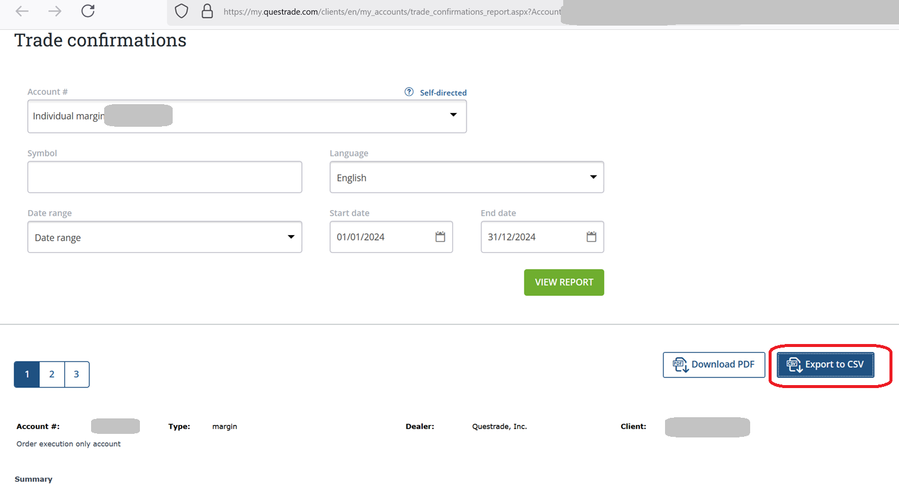

<!-- README.md is generated from README.Rmd. Please edit that file -->

```{r, include = FALSE}
knitr::opts_chunk$set(
  collapse = TRUE,
  comment = "#>",
  fig.path = "man/figures/README-",
  out.width = "100%"
)
```


# acb

The goal of acb is to easily calculate the adjusted cost base for tax purpose.
The main function is `acb::calculate_adjusted_cost_base(df)`,  but a companion function
`acb::import_questrade_csv(path)` is also provided to easily import and prepare the data 
from Questrade "trade confirmations" csv.

## Installation

You can install the development version of acb like so:

```{r, eval = FALSE}
devtools::install_github("SimonCoulombe/acb")
```


## calculate_adjusted_cost_base   

The `acb::calculate_adjusted_cost_base(df)`  function requres an input `df` table that contains the following columns :
  * symbol  
  * settlement_date  
  * action   ("buy" or "sell")  
  * quantity   
  * price  
  * commission   

It returns the same table, augmented with the following columns:   
  * share_balance    
  * adjusted_cost_base  
  * adjusted_cost_base_of_goods_sold  
  * capital_gain    
  * adjusted_cost_base_per_share   
  

Example when applied to the included `df_example` dataset.
```{r}
library(acb)
calculate_adjusted_cost_base(df_example)  %>% knitr::kable()
```

## import_from_questrade_csv

This is a companion function that allows you to import a csv export from the questrade website under "trade confirmations".  The function will parse the numbers  (example:  "(12,345.67)" to "-12345.67" )  and "01-02-03" to "January 2nd 2003) to something that is digestible by R and rename to columns so they match what is expected by 
`calculate_adjusted_cost_base()`

An example csv is included in this package at `inst/extdata/questrade_trade_confirmations` to better display what the input csv looks like.    

```{r}
library(acb)
df_questrade <- acb::import_questrade_csv(system.file("extdata", "questrade_trade_confirmations.csv", package="acb"))
calculate_adjusted_cost_base(df_questrade)    %>% knitr::kable()
```
## Here is how I download my trade confirmations csv:

### step 1  
   

### step 2   


  

### step 3   


