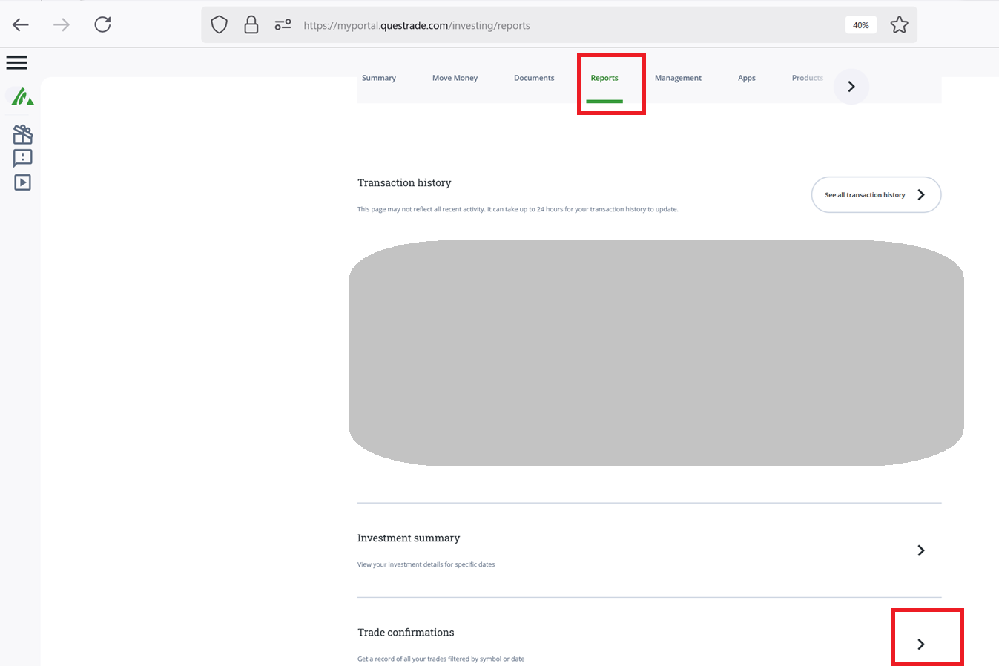
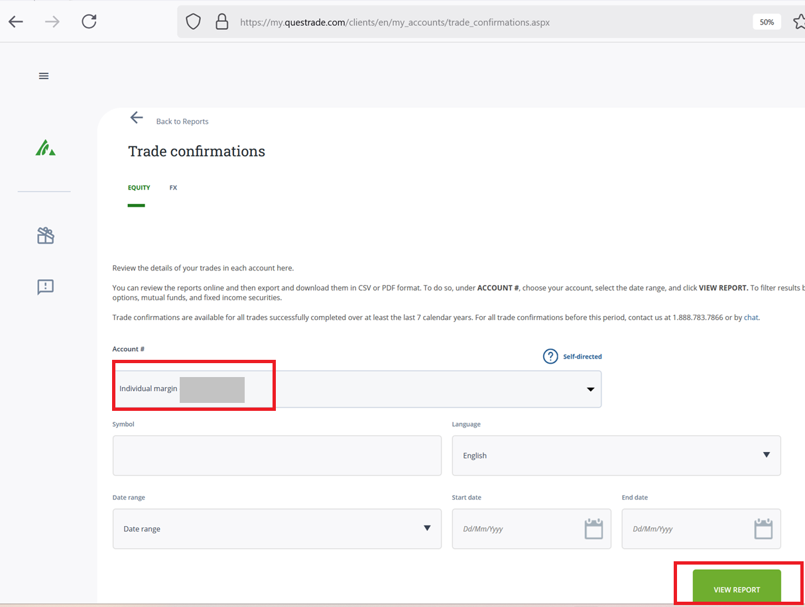
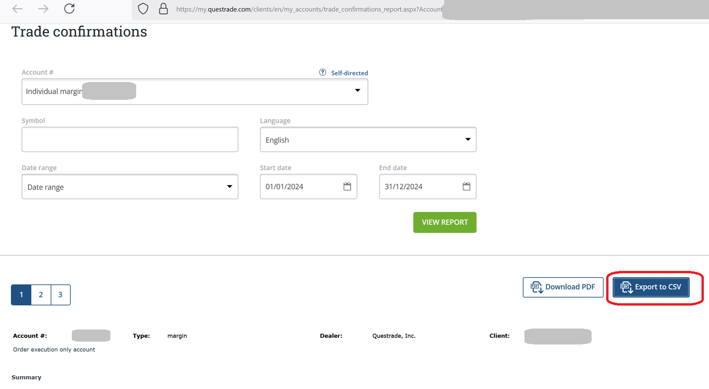

<!-- README.md is generated from README.Rmd. Please edit that file -->

# acb

The goal of acb is to easily calculate the adjusted cost base for tax
purpose. The main function is `acb::calculate_adjusted_cost_base(df)`,
but a companion function `acb::import_questrade_csv(path)` is also
provided to easily import and prepare the data from Questrade “trade
confirmations” csv.

## Installation

You can install the development version of acb like so:

``` r
devtools::install_github("SimonCoulombe/acb")
```

## calculate_adjusted_cost_base

The `acb::calculate_adjusted_cost_base(df)` function requres an input
`df` table that contains the following columns : \* symbol  
\* settlement_date  
\* action (“buy” or “sell”)  
\* quantity  
\* price  
\* commission

It returns the same table, augmented with the following columns:  
\* share_balance  
\* adjusted_cost_base  
\* adjusted_cost_base_of_goods_sold  
\* capital_gain  
\* adjusted_cost_base_per_share

Example when applied to the included `df_example` dataset.

``` r
library(acb)
calculate_adjusted_cost_base(df_example)  %>% knitr::kable()
```

| symbol | settlement_date | action | quantity | price | commission | share_balance | adjusted_cost_base | adjusted_cost_base_of_goods_sold | capital_gain | adjusted_cost_base_per_share |
|:-------|:----------------|:-------|---------:|------:|-----------:|--------------:|-------------------:|---------------------------------:|-------------:|-----------------------------:|
| AAPL   | 2023-01-01      | buy    |       10 |   100 |         10 |            10 |           1010.000 |                               NA |           NA |                     101.0000 |
| AAPL   | 2023-01-03      | buy    |        5 |   110 |          5 |            15 |           1565.000 |                               NA |           NA |                     104.3333 |
| AAPL   | 2023-01-04      | buy    |        7 |   115 |          7 |            22 |           2377.000 |                               NA |           NA |                     108.0455 |
| AAPL   | 2023-01-05      | sell   |        8 |   120 |          8 |            14 |           1512.636 |                         864.3636 |     87.63636 |                     108.0455 |
| META   | 2020-03-03      | buy    |      100 |    50 |         10 |           100 |           5010.000 |                               NA |           NA |                      50.1000 |
| META   | 2020-05-01      | sell   |       50 |   120 |         10 |            50 |           2505.000 |                        2505.0000 |   3485.00000 |                      50.1000 |
| META   | 2020-07-18      | buy    |       50 |   130 |         10 |           100 |           9015.000 |                               NA |           NA |                      90.1500 |
| META   | 2020-09-25      | sell   |       40 |    90 |         10 |            60 |           5409.000 |                        3606.0000 |    -16.00000 |                      90.1500 |
| MSFT   | 2023-01-02      | buy    |       12 |   200 |         12 |            12 |           2412.000 |                               NA |           NA |                     201.0000 |
| MSFT   | 2023-01-06      | sell   |        6 |   210 |          6 |             6 |           1206.000 |                        1206.0000 |     48.00000 |                     201.0000 |
| MSFT   | 2023-01-07      | buy    |        3 |   220 |          3 |             9 |           1869.000 |                               NA |           NA |                     207.6667 |

## import_from_questrade_csv

This is a companion function that allows you to import a csv export from
the questrade website under “trade confirmations”. The function will
parse the numbers (example: “(12,345.67)” to “-12345.67” ) and
“01-02-03” to “January 2nd 2003) to something that is digestible by R
and rename to columns so they match what is expected by
`calculate_adjusted_cost_base()`

An example csv is included in this package at
`inst/extdata/questrade_trade_confirmations` to better display what the
input csv looks like.

``` r
library(acb)
df_questrade <- acb::import_questrade_csv(system.file("extdata", "questrade_trade_confirmations.csv", package="acb"))
#> Rows: 6 Columns: 17
#> ── Column specification ────────────────────────────────────────────────────────
#> Delimiter: ","
#> chr (12): CurrencyCode_Group_Account, Trade Date, Settlement date, Trade #, ...
#> dbl  (3): Price, SEC fees, Interest amount
#> num  (1): Quantity
#> lgl  (1): EX
#> 
#> ℹ Use `spec()` to retrieve the full column specification for this data.
#> ℹ Specify the column types or set `show_col_types = FALSE` to quiet this message.
calculate_adjusted_cost_base(df_questrade)    %>% knitr::kable()
```

| currency_code_group_account               | trade_date | settlement_date | trade_number | action | quantity | symbol | description                                                                  | tb  | ex   | price | gross_amount | commission | sec_fees | interest_amount | net_amount | net_amount_account_currency | share_balance | adjusted_cost_base | adjusted_cost_base_of_goods_sold | capital_gain | adjusted_cost_base_per_share |
|:------------------------------------------|:-----------|:----------------|:-------------|:-------|---------:|:-------|:-----------------------------------------------------------------------------|:----|:-----|------:|-------------:|-----------:|---------:|----------------:|-----------:|----------------------------:|--------------:|-------------------:|---------------------------------:|-------------:|-----------------------------:|
| Canadian stocks and options - Account 666 | 2013-02-06 | 2013-02-11      | QT1          | Buy    |      300 | .VCN   | VANGUARD FTSE CDA ALL CAP, INDEX ETF TR UNIT                                 | A   | TRUE | 31.01 |     -9303.00 |      -0.12 |        0 |               0 |   -9303.00 |                    -9303.00 |           300 |            9302.88 |                               NA |           NA |                     31.00960 |
| Canadian stocks and options - Account 666 | 2014-02-06 | 2014-02-11      | QT2          | Buy    |     1300 | .VCN   | VANGUARD FTSE CDA ALL CAP, INDEX ETF TR UNIT                                 | A   | TRUE | 32.02 |    -41626.00 |      -4.55 |        0 |               0 |  -41626.00 |                   -41626.00 |          1600 |           50924.33 |                               NA |           NA |                     31.82771 |
| Canadian stocks and options - Account 666 | 2015-02-06 | 2015-02-11      | QT3          | Buy    |      400 | .VCN   | VANGUARD FTSE CDA ALL CAP, INDEX ETF TR UNIT, PRIX MOYEN-DETAILS SUR DEMANDE | A   | TRUE | 33.03 |    -13212.00 |      -0.44 |        0 |               0 |  -13212.00 |                   -13212.00 |          2000 |           64135.89 |                               NA |           NA |                     32.06795 |
| Canadian stocks and options - Account 666 | 2016-02-06 | 2016-02-11      | QT4          | Buy    |       50 | .VCN   | VANGUARD FTSE CDA ALL CAP, INDEX ETF TR UNIT                                 | A   | TRUE | 34.04 |     -1702.00 |      -0.04 |        0 |               0 |   -1702.00 |                    -1702.00 |          2050 |           65837.85 |                               NA |           NA |                     32.11602 |
| Canadian stocks and options - Account 666 | 2017-02-06 | 2017-02-11      | QT5          | Sell   |      500 | .VCN   | VANGUARD FTSE CDA ALL CAP, INDEX ETF TR UNIT, PRIX MOYEN-DETAILS SUR DEMANDE | A   | TRUE | 35.05 |     17525.00 |      -5.04 |        0 |               0 |   17525.00 |                    17525.00 |          1550 |           49779.84 |                         16058.01 |     1472.028 |                     32.11602 |
| Canadian stocks and options - Account 666 | 2018-02-06 | 2018-02-11      | QT6          | Buy    |        4 | .VCN   | VANGUARD FTSE CDA ALL CAP, INDEX ETF TR UNIT                                 | A   | TRUE | 36.06 |      -144.24 |      -0.01 |        0 |               0 |    -144.24 |                     -144.24 |          1554 |           49924.07 |                               NA |           NA |                     32.12617 |

## Here is how I download my trade confirmations csv:

### step 1



### step 2



### step 3


